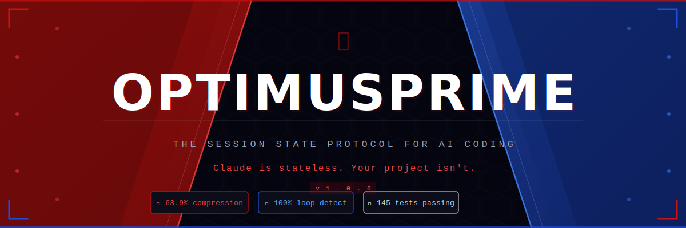

<div align="center">
  
</div>

<br/>

<div align="center">

[](https://github.com/aarshsharma2803-stack/optimusprime/stargazers)
[](https://github.com/aarshsharma2803-stack/optimusprime/releases)
[](https://github.com/aarshsharma2803-stack/optimusprime/tree/main/tests)
[](https://github.com/aarshsharma2803-stack/optimusprime/blob/main/LICENSE)
[](https://python.org)
[](https://github.com/aarshsharma2803-stack/optimusprime#compatible-agents)

</div>

<br/>

<div align="center">
  
</div>

<br/>

# ⚡ OptimusPrime

*Claude forgets. OptimusPrime doesn't.*

**The session state protocol for AI coding.**  
Hook-level enforcement · Cross-session memory · Predictive context · Learning intelligence

[Before / After](#before--after) · [Install](#install) · [What it does](#what-it-does) · [Benchmarks](#benchmarks) · [Protocol](#the-optimusprime-directory) · [Skills Hub](#community-skills-hub)

---

You've explained this codebase to Claude four times this week.

Not because Claude is bad. Because every session starts from zero. No memory of the decisions made yesterday. No knowledge of what approaches already failed. No awareness that you specifically said "do not touch the migrations folder." Claude drifts, re-learns, re-asks, and occasionally writes to `.env` while you're looking away.

OptimusPrime fixes the root cause. It gives Claude a `.optimusprime/` directory that survives every session, every compaction, every restart — and enforces the rules you set at the hook level, before execution, every single time.

**More than meets the eye.**

---

## Before / After

Without OptimusPrime:

```
Day 2, new session.

You:   fix the auth bug we were working on
Claude: I'd be happy to help! Could you tell me about
        your authentication system and what bug you're
        experiencing?

You:   [explains everything again — the JWT approach,
        why you rejected sessions, the three attempts
        that already failed, the files that are off limits]

Claude: [re-learns everything, suggests an approach
         that was explicitly rejected yesterday,
         touches a file you said was frozen]
```

With OptimusPrime:

```
Day 2, new session.

You:   fix the auth bug we were working on
Claude: Context restored — JWT middleware refactor.
        18 decisions on record. 3 past failures indexed.
        Continuing from: implement refresh token rotation.

[starts immediately, knows the decisions, avoids
 the failures, respects the scope. no re-explaining.]
```

When Claude tries to touch a frozen file:

```
OPTIMUSPRIME BLOCKED: prisma/migrations is out of scope.
Edit .optimusprime/contract.json to change this.
```

When Claude is stuck in a loop:

```
OPTIMUSPRIME: Same failure 3 times. Stop and ask.
[blocks the fourth attempt so you don't burn tokens
 watching Claude retry what already failed twice]
```

---

## What it does

**1. Remembers every decision.**
Every time Claude chooses an approach, picks a library, rejects an alternative, or makes an assumption — it's appended silently to `.optimusprime/decisions.md`. Timestamped. Structured. Committed with your code. A permanent record of why things are the way they are.

**2. Restores context instantly.**
Start a new session on any machine, paste one snapshot, and Claude knows the goal, every decision made, what failed, what's in progress, and what to do next. Zero re-explaining. `op snapshot` shows you what Claude will know.

**3. Enforces scope at the hook level.**
You define what's in bounds and what isn't. OptimusPrime blocks every Write, Edit, MultiEdit, and Bash call that targets an out-of-scope file — before execution, at the PreToolUse hook. Not a CLAUDE.md suggestion Claude can forget mid-session. A hard block that fires regardless of what's in the context window.

**4. Stops loops before they cost you.**
Failure signatures are tracked. The same error three times in a row and Claude is blocked from trying again. It's told to stop and ask. The loop-detector catches it; you don't have to.

**5. Compresses output without touching code.**
63.9% fewer characters in Claude's responses — preamble stripped, post-code summaries gone, restatements removed, filler transitions deleted. Code blocks are never touched. The engineering stays. The noise leaves.

**6. Learns what you've tried.**
Every failed attempt is logged to `.optimusprime/attempts.md` with the error signature. The next time Claude touches the same file, it knows what already failed. It doesn't retry it. The list persists across sessions.

**7. Gets smarter over time.**
Session 1 and session 50 are not the same. The learning engine runs after every session — it updates your real skill activation thresholds, indexes failure patterns per file, models your preferences, and detects when decisions contradict each other. It feeds all of it back into the predictive context layer so the next session starts better than the last.

**8. Manages the best tools in the ecosystem.**
One command installs Superpowers, gstack, UI/UX Pro Max, caveman, ponytail. OptimusPrime keeps them updated, activates the right one based on what you're doing right now, and learns your real activation thresholds from actual usage — not defaults.

---

## Benchmarks

```
┌─────────────────────────────────────────────────────┐
│  Output compression      ████████████████░░░░  63.9% │
│  (non-destructive — code blocks untouched)           │
│                                                       │
│  Loop detection accuracy ████████████████████  100%  │
│  (20 test sequences, 0 false positives)              │
│                                                       │
│  Input token reduction   ████████████████░░░░  40%+  │
│  (after 20 decisions, predictive injection)          │
│                                                       │
│  Decision search          ████████████████████  fast │
│  (0.02ms avg · 66 entries · 100 queries)             │
└─────────────────────────────────────────────────────┘
```

| Metric | Result | Method |
|--------|--------|--------|
| Output compression | 63.9% avg | 20 verbose Claude response samples |
| Scope guard latency | 75ms avg | n=1,000 runs |
| Loop detection | 100% accuracy | 20 test sequences, 0 FP, 0 FN |
| Decision search | 0.02ms avg | 66 entries, 100 queries |
| Session logger | 0.12s | n=10 runs |
| Input token reduction | 40%+ | after 20 decisions, predictive injection |
| Contradiction detection | 163ms | 101 decisions, n=50 |
| Context prediction | 0.77ms avg | 100 queries, warm cache |
| Learning cycle | 1.8ms avg | 10 sessions simulated |

Compression is non-destructive. Every line of code survives untouched.  
145 tests passing. [Full benchmark suite →](benchmarks/)

---

## Install

Roll out.

```bash
# macOS / Linux
git clone https://github.com/aarshsharma2803-stack/optimusprime
cd optimusprime
bash install.sh
```

```powershell
# Windows (PowerShell 5.1+)
git clone https://github.com/aarshsharma2803-stack/optimusprime
cd optimusprime
.\install.ps1
```

~45 seconds. Needs Python 3.8+. Idempotent — safe to run again after updates.

The installer: creates a venv, registers all hooks in `~/.claude/settings.json`, copies skills, sets up the MCP server. Restart Claude Code once. Then open any project and start working. OptimusPrime activates silently on your first message.

**Verify the install:**
```bash
op snapshot      # shows current session state
op decision list # shows logged decisions
op intel summary # shows project intelligence
```

If `op` isn't found: `pip install -e .` inside the repo, or add `~/.optimusprime/venv/bin` to your PATH.

---

## The `.optimusprime/` directory

OptimusPrime writes everything to a `.optimusprime/` directory at your project root. This is the protocol — the `.git/` of AI sessions.

Any agent that reads files can read it. Any tool can write to it. It commits with your code. It survives account changes, machine switches, and agent upgrades.

| File | What it contains | Commit? |
|------|-----------------|---------|
| `contract.json` | Scope contract — goal, in-scope files, out-of-scope files, complexity budget, agent assignments | No — session-specific |
| `decisions.md` | Every architectural choice, library selection, rejected alternative, assumption made. Append-only, 120 char/line | **Yes — shared knowledge** |
| `session-snapshot.md` | Goal, files changed, decisions made, open threads, next action. Paste at session start for instant context | No — session-specific |
| `attempts.md` | Failed approaches with error signatures. Injected before new attempts. | No — session-specific |
| `resume.json` | Where the last session was when it ended or was interrupted | No — session-specific |
| `patterns.json` | Learned thresholds, failure patterns, user preferences, decision clusters | **Yes — compounds over time** |
| `skills.json` | Installed community skills, versions, activation modes | **Yes — shared config** |
| `todos.md` | Newly added TODOs requiring resolution or deferral before session end | No — session-specific |

**Recommended `.gitignore` additions:**
```
.optimusprime/contract.json
.optimusprime/session-snapshot.md
.optimusprime/resume.json
.optimusprime/attempts.md
.optimusprime/todos.md
.optimusprime/*-log.json
.optimusprime/*-state.json
```

**Commit these:**
```
.optimusprime/decisions.md
.optimusprime/patterns.json
.optimusprime/skills.json
.optimusprime/.gitkeep
```

---

## Community Skills Hub

OptimusPrime ships with a curated registry of the best Claude Code skills. One command installs any of them. They're updated automatically between sessions — never mid-session — and the right one activates based on what you're working on.

| Skill | Stars | Activates when | License |
|-------|-------|----------------|---------|
| [Superpowers](https://github.com/obra/Superpowers) | 237k | complex session, full complexity budget | MIT |
| [gstack](https://github.com/garrytan/gstack) | 117k | manual — slash commands on demand | MIT |
| [UI/UX Pro Max](https://github.com/nextlevelbuilder/ui-ux-pro-max-skill) | 97k | `.tsx`, `.css`, `tailwind.config` files touched | MIT |
| [caveman](https://github.com/JuliusBrussee/caveman) | 62k | token estimate over 40k (learned per user) | MIT |
| [ponytail](https://github.com/DietrichGebert/ponytail) | 60k | complexity budget: minimal | MIT |

```bash
op skills install superpowers
op skills install caveman
op skills install --all          # install everything
op skills status                 # versions, modes, update availability
op skills update                 # update all within policy
op skills rollback caveman       # restore previous version
op skills pin superpowers@6.0.3  # lock to exact version
```

Skills are installed fresh from their source repos — never bundled, never patched. Update policy per skill: patch and minor updates apply silently between sessions. Major versions notify and wait for you to decide.

After a few sessions, the learning engine updates activation thresholds based on your actual usage. If you consistently activate caveman at 38k tokens rather than the default 60k, it learns that. It doesn't ask. It just adjusts.

---

## CLI reference

```bash
# Decisions
op decision search "why zod"    # semantic search over decision history
op decision list --last 10      # most recent decisions
op decision count               # total decisions logged

# Session state
op snapshot                     # current session state
op resume                       # what was in progress when last session ended

# Scope
op contract                     # view current scope contract
op contract edit                # open in $EDITOR
op contract show-scope          # in-scope and out-of-scope as two lists

# Intelligence
op intel ask "why is auth complex here"   # reason over decision history
op intel contradictions                    # hard contradictions first
op intel patterns                          # topic clusters with velocity
op intel summary                           # full cross-topic overview
op intel learned                           # what patterns.json has accumulated
op intel session-history                   # timeline of past sessions

# Accountability
op todos                        # unresolved TODOs from this session
op cost                         # session cost estimate and history
op history --last 7             # last 7 days of sessions

# CLAUDE.md
op claude-md generate           # generate project-specific CLAUDE.md from codebase
op claude-md status             # staleness score
op claude-md sync               # show what's missing

# Skills
op skills list                  # registry with installed markers
op skills install <name>        # install from registry
op skills status                # all installed skills, versions, modes
op skills update                # update within policy
```

---

## MCP Server

OptimusPrime exposes everything in `.optimusprime/` as MCP tools any agent can query directly.

Register in Claude Code:
```json
{
  "mcpServers": {
    "optimusprime": {
      "command": "python",
      "args": ["-m", "optimusprime.mcp.server"]
    }
  }
}
```

| Tool | What it returns |
|------|----------------|
| `get_contract()` | Current scope — goal, files, complexity budget, agent assignments |
| `search_decisions(query, top_k=5)` | TF-IDF ranked decisions. Ask "why did we choose zod" — it finds the entry. |
| `get_snapshot()` | Last session state, parsed and structured |
| `get_attempts(last_n=10)` | Failed tool calls with error signatures |
| `get_todos()` | Unresolved TODOs grouped by file |
| `get_cost()` | Session cost estimate and history |
| `reason_about(question)` | Synthesizes an answer from decisions, attempts, and patterns. Not search — reasoning. |
| `get_contradictions(severity)` | Hard and soft contradictions across all decisions |
| `get_patterns()` | Topic clusters, velocity, unstable areas |

`reason_about` is the one that matters. Ask it "why is the authentication layer this complex" and it tells you: decisions made, approaches rejected, known failures, detected contradictions, confidence level. Any agent that supports MCP gets genuine project intelligence, not just a log file.

---

## Why enforcement beats suggestions

Every other tool in this ecosystem — Superpowers, gstack, caveman, ponytail — puts instructions in `CLAUDE.md` or skill files. Claude reads them. Claude follows them. Until it doesn't.

Three hours into a session, 40 tool calls deep, the context window is crowded. The instruction from CLAUDE.md that said "never touch `.env`" is buried. Claude has new information. Claude makes a judgment call. Claude writes to `.env`.

This is not a Claude problem. It is a prompt-level instruction problem. Prompts can be forgotten. Hooks cannot.

OptimusPrime's PreToolUse hook runs before every Write, Edit, MultiEdit, and Bash call. It doesn't consult the context window. It reads `contract.json` from disk, checks the target path, and decides: pass or block. The decision happens at the OS level, before Claude's output reaches your filesystem.

```
You said: don't touch migrations/
Claude decided: touch migrations/
OptimusPrime: no
```

That's it. No negotiation. No context-window state required. Same behavior in session 1 as session 100.

---

## The intelligence layer

OptimusPrime gets smarter over time. This is the part that separates it from a disciplined logging tool.

**Contradiction detection.** When a new decision conflicts with a past one — "use SQLite" when a previous session decided against it — OptimusPrime catches it. Hard contradictions surface immediately. Soft contradictions (cosine similarity > 0.75) surface in `op intel contradictions`. Neither is a block. Both are information.

**Predictive context injection.** Before any file edit, OptimusPrime doesn't inject the last 10 decisions. It injects the 5 most *relevant* ones — ranked by TF-IDF similarity to the current file, function, and tool call. After 50 sessions, a write to `auth/middleware.ts` surfaces the decisions about JWT, not the ones about the database schema.

**Cross-session learning.** After every session, the learning engine runs. It updates skill activation thresholds from actual usage. It indexes failure patterns per file. It models your explanation preferences. The patterns compound. Session 50 is measurably smarter than session 1.

```bash
op intel summary
# OPTIMUSPRIME INTELLIGENCE REPORT
# 123 decisions · 12 sessions · 8 topics
# Most active: auth (34 decisions)
# Top rejected: yup (4x) · sessions (3x) · class-based (2x)
# Preferred: zod · functional · TypeScript strict
# Confidence: HIGH
```

---

## Compatible agents

**Full support (hooks + skills + MCP):** Claude Code · Antigravity (agy) · Codex CLI

**Skills + MCP (no hooks):** Cursor · Windsurf · Cline · any MCP-capable agent

**Protocol only (.optimusprime/ readable):** Any agent that reads files

---

## Built with itself

OptimusPrime was built across 12 Claude Code sessions with OptimusPrime enforcing its own scope, logging its own decisions, and compressing its own output from session one.

The `.optimusprime/decisions.md` in this repo contains 123 decisions made during the build — every library choice, every architectural call, every alternative rejected. It's not documentation written after the fact. It's a live record of the build.

```bash
op intel ask "why pure stdlib for hooks"
# Based on 4 decisions across 3 sessions:
# Current approach: stdlib only, no pip dependencies
# Why: hooks must be zero-dependency — pip unavailable
#      in some Claude Code environments at hook runtime
# Rejected: requests, httpx (network deps)
# Rejected: numpy (too heavy for hook latency budget)
# Confidence: HIGH
```

See the full build log: [.optimusprime/decisions.md](.optimusprime/decisions.md)

---

## FAQ

**Does it need configuration?** No. Install it, open a project, start working. OptimusPrime reads your first message and extracts the scope contract silently. If the intent is clear, nothing is asked. If it's ambiguous, one question.

**What if I want to touch a file that's out of scope?** Edit `.optimusprime/contract.json` or run `op contract edit`. The hook re-reads the contract on every call — changes take effect immediately.

**Does it work on existing projects?** Yes. Drop a `.optimusprime/` directory at the project root and start a session. It doesn't require a clean start.

**What happens when the context window compacts?** The PreCompact hook fires. `session-snapshot.md` is written. When the new context starts, OptimusPrime injects the snapshot automatically. The decisions, contract, and patterns survive compaction.

**Does it slow down Claude Code?** Scope guard averages 75ms. Context prediction averages 0.77ms on warm cache. Zero overhead when nothing to do.

**Will Anthropic ship this natively?** Parts of it, maybe. The data layer won't be touched — `.optimusprime/` is repo-local and user-defined. Hook-level enforcement can't be shipped generically because the contract is project-specific. The three things that make OptimusPrime useful are the three things Anthropic can't replace with a platform feature.

**Why `optimusprime`?** Because it transforms sessions. Roll out.

---

## Contributing

[CONTRIBUTING.md](CONTRIBUTING.md) — hook invariants, test requirements, PR checklist, how to add a skill to the curated registry.

The bar: every hook must never crash Claude Code, must exit 0 silently when nothing to do, and must handle missing `.optimusprime/` gracefully. Tests before PRs. Benchmarks before new hooks.

---

## License

MIT. Use it, modify it, ship it, build on it. Keep the LICENSE file.

---

*Claude is stateless. Your project isn't.*  
*OptimusPrime bridges the gap.*

[](https://star-history.com/#aarshsharma2803-stack/optimusprime&Date)
